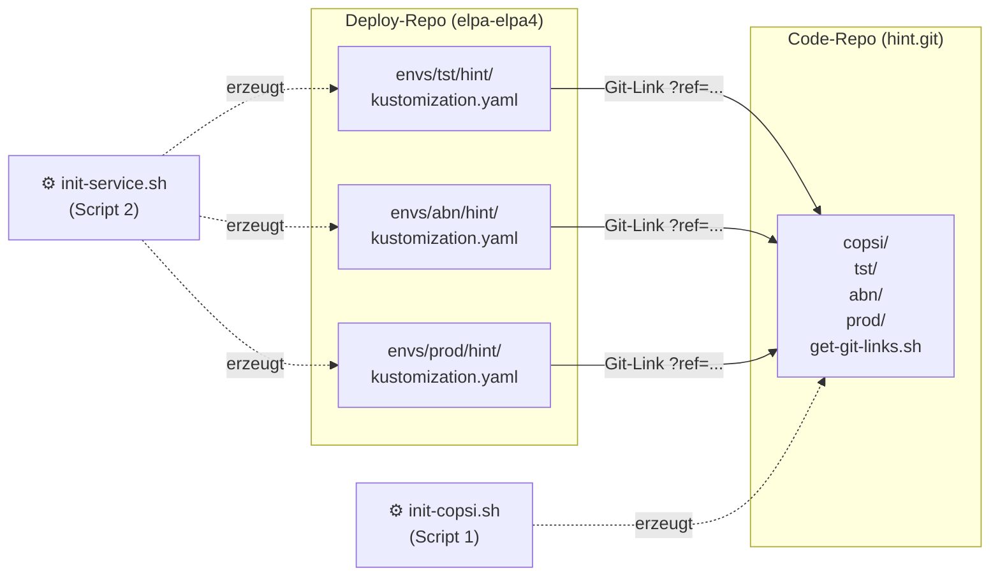

# copsi-init – Dokumentation

## 1. Wie funktioniert ein Git-Link als Kustomize-Komponente?

In Kustomize kann man externe Ressourcen direkt aus einem Git-Repository laden – ohne die Dateien lokal zu kopieren. Das nennt sich **Remote Component**.

### Warum ist das wichtig?

Der Service-Code und die Deploy-Konfiguration liegen in **zwei getrennten Repos**:

| Repo | Inhalt |
|---|---|
| `hint.git` (Code-Repo) | Istio-Konfiguration, ConfigMap-Werte (`copsi/`) |
| `elpa-elpa4` (Deploy-Repo) | Kustomization pro Umgebung (`envs/tst/hint/`) |

Das Deploy-Repo zeigt per Git-Link auf eine bestimmte Version der Konfiguration im Code-Repo. So bleibt alles versioniert und nachvollziehbar.

### Aufbau eines Git-Links

```
https://git.system.local/scm/elpa/hint.git  //  copsi/tst  ?ref=  05ec3e1b5519f98d
```

| Teil | Wert | Bedeutung |
|---|---|---|
| `https://git.system.local/scm/elpa/hint.git` | Repository-URL | Zeigt auf das Code-Repo des Services |
| `//` | Trennzeichen | Trennt Repository-URL vom Pfad innerhalb des Repos |
| `copsi/tst` | Pfad | Ordner im Repo der die Konfiguration enthält |
| `?ref=` | Parameter | Gibt an, welcher Commit geladen werden soll |
| `05ec3e1b5519f98d` | Commit-Hash | Exakte Version – wird bei jedem Update erneuert |

### Beispiel

**Code-Repo** (`hint.git`) enthält unter `copsi/tst/`:
```yaml
# copsi/tst/kustomization.yaml
apiVersion: kustomize.config.k8s.io/v1alpha1
kind: Component

configMapGenerator:
  - name: backend-cm
    behavior: merge
    literals:
      - SERVICE_NAME=hint
      - AUTH_URL=https://employee.login.int.signal-iduna.org/
```

**Deploy-Repo** (`elpa-elpa4`) referenziert diesen Stand per Git-Link:
```yaml
# envs/tst/hint/kustomization.yaml
components:
  - https://git.system.local/scm/elpa/hint.git//copsi/tst?ref=05ec3e1b5519f98d
```

Kustomize lädt beim Build den Inhalt von `copsi/tst/` genau aus dem Commit `05ec3e1b...`. Ändert sich die Konfiguration im Code-Repo, muss nur der `ref=`-Wert im Deploy-Repo aktualisiert werden – das ist die einzige Verbindung zwischen den beiden Repos.

---

## 2. Die zwei Scripts

### Überblick



Script 1 (`init-copsi.sh`) läuft im **Code-Repo** und erzeugt die `copsi/`-Ordner.
Script 2 (`init-service.sh`) läuft im **Deploy-Repo** und erzeugt die Kustomization-Dateien.

---

### Script 1 – `init-copsi.sh` (im Code-Repo ausführen)

```shell
git clone ssh://git@git.system.local:7999/elpa/copsi-init.git &&\
cd copsi-init &&\
chmod +x init-copsi.sh &&\
rm -rf .git &&\
./init-copsi.sh &&\
cd .. &&\
rm -rf copsi-init
```

> **Warum `rm -rf .git`?**
> Das Script führt `git`-Befehle im übergeordneten Verzeichnis (dem Code-Repo) aus.
> Das `.git` von `copsi-init` wird vorher entfernt, damit `git` nicht das falsche Repo nimmt.

**Was passiert Schritt für Schritt:**

1. Das Script prüft, ob der Working Tree des Code-Repos sauber ist (kein offener Stand).
2. Es fragt nach:
   - Service-Name (z.B. `hint`)
   - PostgreSQL ja/nein → Schema-Name
   - Kafka ja/nein
   - OAuth2 ja/nein
3. Es erstellt `copsi/tst/`, `copsi/abn/`, `copsi/prod/` aus einem Blueprint mit den richtigen Platzhaltern.
4. Es kopiert `get-git-links.sh` in den `copsi/`-Ordner.
5. Es macht automatisch `git add`, `git commit` und `git push` ins Code-Repo.
6. Am Ende gibt es die fertigen Git-Links für alle drei Umgebungen aus:

```
tst:  https://git.system.local/scm/elpa/hint.git//copsi/tst?ref=05ec3e1b...
abn:  https://git.system.local/scm/elpa/hint.git//copsi/abn?ref=05ec3e1b...
prod: https://git.system.local/scm/elpa/hint.git//copsi/prod?ref=05ec3e1b...
```

> ⏳ **Wichtig:** Die Git-Links sind erst verwendbar, nachdem der Jenkins-Build
> erfolgreich durchgelaufen ist und das Docker-Image in die Registry gepusht wurde.

**Git-Links erneut abrufen** (nach jedem weiteren Push):
```shell
./copsi/get-git-links.sh
```

---

### Script 2 – `init-service.sh` (im Deploy-Repo ausführen)

```shell
git clone ssh://git@git.system.local:7999/elpa/copsi-init.git &&\
cd copsi-init &&\
chmod +x init-service.sh &&\
./init-service.sh &&\
cd .. &&\
rm -rf copsi-init
```

> **Kein `rm -rf .git` nötig**, da dieses Script keine `git`-Befehle ausführt.
> Es arbeitet nur mit Dateien.

**Was passiert Schritt für Schritt:**

1. Das Script fragt nach dem Git-Link (Ausgabe von Script 1).
2. Es liest daraus automatisch: Service-Name, Umgebung und Commit-Hash.
3. Es prüft die Docker-Registry und ermittelt den passenden Image-Tag.
4. Es fragt nach PostgreSQL und Kafka.
5. Es erstellt `envs/<env>/<service>/kustomization.yaml` im Deploy-Repo.
6. Es trägt den Service automatisch in `envs/<env>/kustomization.yaml` unter `resources` ein.

**Wenn die Datei bereits existiert** (Update-Fall):
Das Script überschreibt **nur** den `ref=`-Wert und den `newTag`. Alle anderen manuellen Änderungen in der Datei bleiben erhalten.

---

## 3. Wichtige Hinweise nach Script 2

Am Ende von `init-service.sh` erscheinen Warnungen für manuelle Schritte, die **vor dem Deployment** erledigt werden müssen.

### ⚠️ Kafka – Topics registrieren

Wenn der Service Kafka verwendet, müssen alle Topics des Services in der Kafka-Konfiguration eingetragen werden:

```
Datei: elpa-elpa4/kafka/values.yaml
```

Beispiel:
```yaml
kafka:
  topics:
    - name: elpa-hint-created-tst
      partitions: 2
      retention.ms: 604800000
```

> Wird dieser Schritt vergessen, schlägt die Kafka-Verbindung beim Start des Services fehl.

### ⚠️ Deploy – Service in Umgebung registrieren

Der Service muss in der Kustomization der Zielumgebung unter `resources` stehen:

```
Datei: elpa-elpa4/envs/<env>/kustomization.yaml
```

```yaml
resources:
  - hint   # ← dieser Eintrag muss vorhanden sein
```

> Das Script erledigt dies automatisch – diese Warnung dient zur Kontrolle.

---

## 4. Fehlerbehandlung

### Script 1 – `init-copsi.sh`

| Problem | Ursache | Lösung |
|---|---|---|
| `❌ Dieses Verzeichnis ist kein Git-Repository` | Script läuft nicht im Code-Repo | `copsi-init` direkt im Code-Repo-Ordner klonen und ausführen |
| `⚠️ Es gibt noch nicht committete Änderungen` | Offene Änderungen im Code-Repo | `git add . && git commit -m "..."` ausführen, dann Script neu starten |
| `fatal: ... has no upstream branch` | Branch hat noch kein Remote | Wird automatisch mit `git push -u origin HEAD` behandelt |
| Git-Links zeigen auf falschen Stand | `copsi/` wurde committed bevor Push fertig war | `./copsi/get-git-links.sh` erneut ausführen, nachdem Push abgeschlossen ist |

### Script 2 – `init-service.sh`

| Problem | Ursache | Lösung |
|---|---|---|
| `❌ Ungültiger Git-Link` | Falsches Format eingegeben | Link muss das Format `...hint.git//copsi/tst?ref=<hash>` haben |
| `⚠️ Registry nicht erreichbar` | Netzwerk oder Registry down | Image-Tag manuell eingeben wenn das Script danach fragt |
| `❌ ... nicht gefunden` | Deploy-Repo hat keine `envs/<env>/kustomization.yaml` | Script wurde nicht im richtigen Verzeichnis ausgeführt – `copsi-init` muss direkt in `elpa-elpa4` geklont sein |
| Image-Tag nicht in Registry | Jenkins-Build läuft noch oder ist fehlgeschlagen | Warten bis Build fertig, dann Script neu starten |
| Falscher `ref=` nach Update | Alter Git-Link verwendet | `./copsi/get-git-links.sh` im Code-Repo ausführen und neuen Link verwenden |

### Änderungen rückgängig machen

Da alle Änderungen in Git versioniert sind, kann mit Standard-Git-Befehlen zurückgegangen werden:

```shell
# Letzte Änderung im Deploy-Repo rückgängig machen
git revert HEAD

# Datei auf letzten committed Stand zurücksetzen
git checkout -- envs/tst/hint/kustomization.yaml

# Änderungen anzeigen bevor man zurücksetzt
git diff envs/tst/hint/kustomization.yaml
```